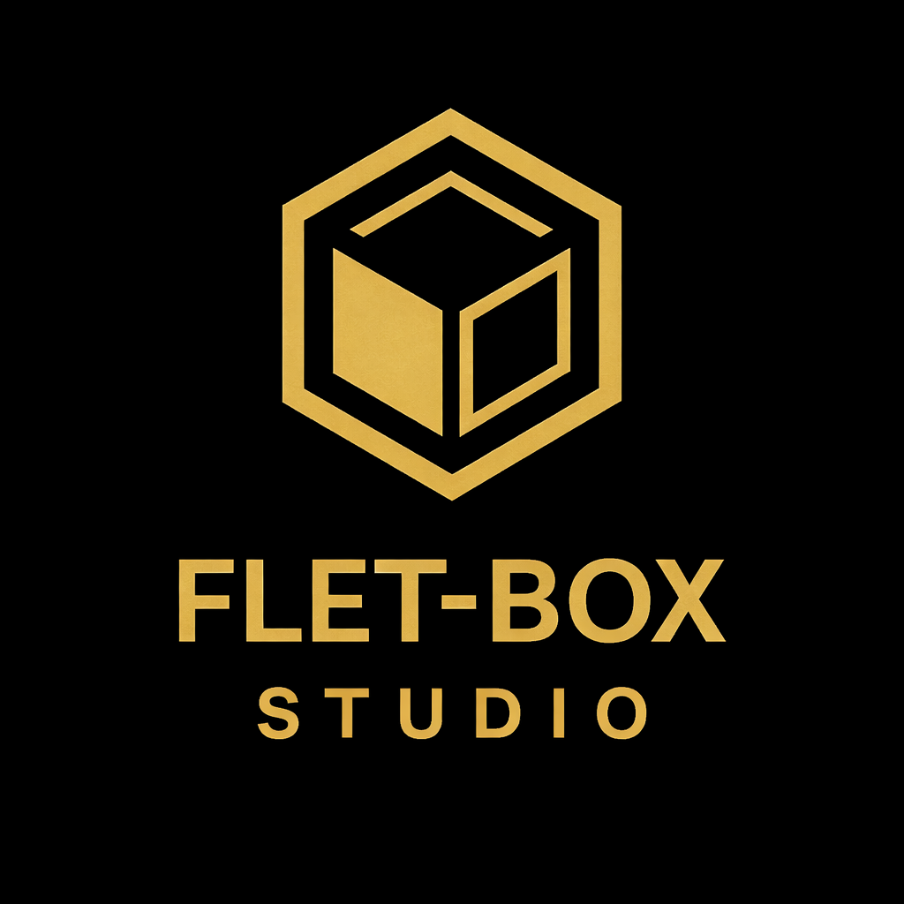

<div align="center">



<h1>FletBox</h1>

<b>A zero-dependency, vanilla-JS UI framework with a Flutter/Flet-like declarative API.</b><br>
Real DOM · No Virtual DOM · Web, PWA, Android &amp; iOS from one codebase.

<br>

<a href="https://github.com/sponsors/kuko53348"></a>

<br><br>

<a href="https://github.com/kuko53348/flet-box/blob/HEAD/LICENSE"></a>
<a href="https://www.npmjs.com/package/flet-box"></a>


<a href="https://github.com/kuko53348/flet-box"></a>

<br><br>

<a href="#quick-start">Quick start</a> •
<a href="#documentation">Documentation</a> •
<a href="#support--sponsorship">❤️ Sponsor</a> •
<a href="https://github.com/sponsors/kuko53348">Become a sponsor</a>

</div>

---

FletBox is a lightweight UI framework for building web interfaces with vanilla JavaScript. It offers a declarative, Flet-inspired API — with no external runtime dependencies and no Virtual DOM.

## Quick start

```javascript
import { runApp, Container, Text, Button, useState } from "flet-box";

const App = () => {
  const [count, setCount] = useState("count", 0);

  return Container({
    width: "100%",
    minHeight: "100vh",
    display: "flex",
    justifyContent: "center",
    alignItems: "center",
    child: [
      Text({ text: `Counter: ${count}`, fontSize: 24, fontWeight: 700 }),
      Button({ text: "Increment", onClick: () => setCount((v) => v + 1) }),
    ],
  });
};

runApp(App);
```

## Installation

```bash
brew install node                 # macOS/Linux: ensure Node >= 18

git clone https://github.com/kuko53348/flet-box.git
cd flet-box
npm link                          # link the flet-box CLI globally

flet-box create appName           # scaffold your first app
cd appName
npm link flet-box

flet-box run-spa                  # run as SPA with hot reload
flet-box run-bundle               # or run the bundled app
```

## Features

- Declarative, widget-based UI
- Zero runtime dependencies; ESM only, Node >= 18
- Real DOM — no Virtual DOM
- Reactive state with `useState`
- Router for SPAs
- Local storage and HTTP services
- Theme, PWA, and production builds
- Android and iOS builds from the CLI (APK, simulator `.app`, `.xcarchive`)
- Utility API for layout, text, color, animation, and more

## Commands

```bash
npm run dev       # start the dev server on port 8000
npm run build     # generate the production bundle with esbuild
```

Inside a generated project:

```bash
flet-box createBundle www     # bundle the app into www/
flet-box build android        # Android debug APK
flet-box build ios            # iOS Simulator app (macOS + Xcode)
flet-box build ios --archive  # unsigned iOS device archive, to sign in Xcode
```

## Android and iOS

Projects created with `flet-box create` already contain the Capacitor
configuration, so the same SPA builds for both platforms. FletBox is not
published to npm, so link it into the project before installing:

```bash
flet-box create my-app
cd my-app
npm link flet-box              # or: npm install ../path/to/flet-box
npm install                    # Capacitor CLI, sharp, platform package
```

- **Android** needs Node.js >= 20.9, a JDK, and the Android SDK (Android Studio installs both). Run `flet-box build android` for a debug APK, then sign releases in Android Studio or with `./gradlew assembleRelease` / `bundleRelease`.
- **iOS** needs macOS, the **full** Xcode app (not the Command Line Tools), an iOS simulator runtime, and CocoaPods. Run `flet-box build ios` for the simulator, or `flet-box build ios --archive` to sign for a device or the App Store in Xcode.
- Both platforms read the icon from `assets/logo.png` — use 1024×1024 and just rebuild. Icons, launch images, and the launch screen are regenerated automatically.
- Capacitor serves the app from `https://localhost`, so a remote API must allow that origin in its CORS config.

The full platform guide, including manual `npx cap` workflows, is in
[Mobile and platforms](docs/guides/mobile-and-platforms.md).

## Documentation

The docs are **one continuous book** — read it in order. The front cover maps every page and is the index of everything: [The FletBox Book](docs/README.md).

- [Your first app](docs/guides/first-app.md) — build a working todo app in 20 minutes
- [The widget book](docs/widget/README.md) — every widget with property tables and examples
- [State, Router & Services](docs/guides/state.md) — shared state, routing, storage, and HTTP
- [Tools & Utilities](docs/tools/README.md) — every helper function with signatures
- [The CLI](docs/cli/README.md) — create, run, and build projects
- [FletBox Server](docs/server/README.md) — backend toolkit: API, authentication, security, and data services
- [SQLite and the API server](docs/server/data-services.md) — where your data lives (browser vs server), the `better-sqlite3` wrapper, and a full SQLite API example
- [Mobile and platforms](docs/guides/mobile-and-platforms.md) — Android, iOS, PWA, and desktop
- [Contributing](docs/CONTRIBUTING.md) — how to add code and docs

## Architecture

A map of how FletBox is organized internally — the widget contract, the single
rendering engine, and how the docs stay in sync:
[Architecture](docs/arquitectura.md).

## Support & sponsorship

<div align="center">

<a href="https://github.com/sponsors/kuko53348">
  
</a>

<br><br>

**FletBox is MIT-licensed and free forever — for individuals and companies alike.**

It has **zero dependencies** and it stays that way because people like you chip in.
One developer, a whole framework, and no corporate budget behind it.

### ► [Sponsor FletBox on GitHub](https://github.com/sponsors/kuko53348) ◄

</div>

### Where your sponsorship goes

| | Your money funds |
|---|---|
| 🧩 | **New widgets & components** — the library grows with every release |
| 📖 | **Documentation & examples** — the full FletBox Book, guides, and tutorials |
| 🧪 | **Testing & stability** — the browser harnesses and contract checks that keep the core reliable |
| 📱 | **Mobile toolchain** — Android & iOS builds, Capacitor integration, PWA |
| ⏱️ | **Time** — what turns "nights and weekends" into sustained work |

### Sponsor tiers

| Tier | Perks |
|------|-------|
| ☕ **$3 / mo** — Coffee | My thanks + the good karma of keeping open source free |
| 🚀 **$10 / mo** — Supporter | Shout-out in the Sponsors wall + priority on issue replies |
| 🏢 **$50 / mo** — Backer | Your name/logo in this README & docs + feature-request voting |
| 💎 **Custom** — Partner | Logo + link, priority support, and a say in the roadmap — [email me](mailto:kuko53348@gmail.com) |

> One-time contributions are welcome too — pick any amount on the
> [sponsorship page](https://github.com/sponsors/kuko53348).

### Other ways to support

- 💳 **Crypto donation** (Polygon / MATIC-POL) directly to the maintainer:
  `0x6d437bB66af8d2c44670eA18F059BE1417Dcd7bA`
- 💼 **Commercial support, consulting, or priority help:**
  [kuko53348@gmail.com](mailto:kuko53348@gmail.com)
- ⭐ **Star the repo** and tell a colleague — visibility is free and it helps enormously

<sub>Living in Cuba makes traditional payment platforms like Mastercard hard to access, so crypto support is especially valuable. Every contribution — a sponsor tier, a donation, a star, or spreading the word — keeps FletBox growing. Thank you. 🙏</sub>

### ❤️ Our sponsors

<!-- Add sponsor logos/links here as they come in. Example:
<a href="https://github.com/their-username"></a>
-->

<div align="center">

_This space is empty — **be the first!**_

<a href="https://github.com/sponsors/kuko53348">
  
</a>

</div>

## License

MIT — free for everyone to use, modify, redistribute, and build commercial
products with. See [LICENSE](LICENSE).

Copyright (c) 2026 Maenys Javier Quesada Reyes.
